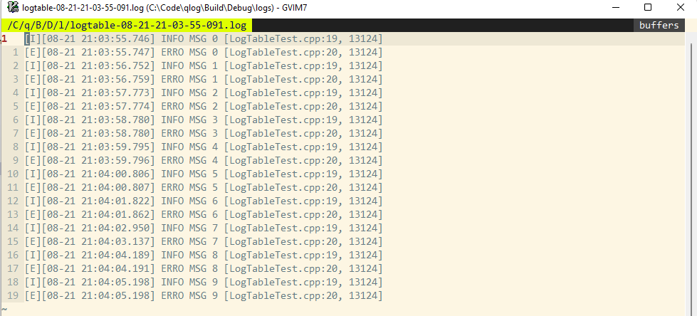
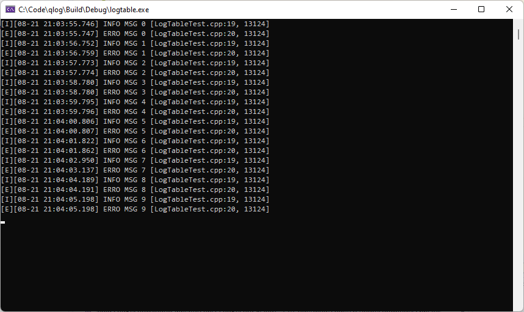
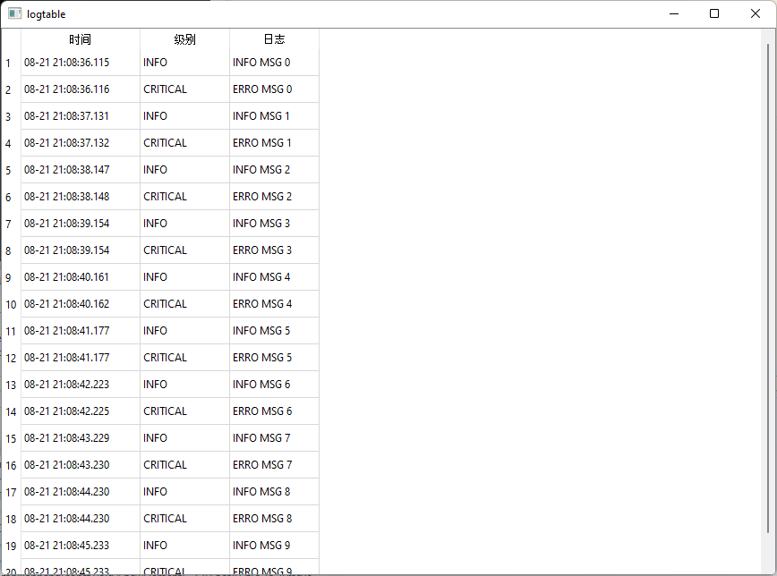

# QLOG

A LOG LIBRARY BASED ON QT LOG SYSTEM


## USAGE


file and console output

```c++
#include <qlog/qlog.h>
#include <QCoreApplication>
#include <QDebug>


int main(int argc, char** argv)
{
    QCoreApplication a(argc, argv);
    install_log_handler("log2file");

    qDebug() << "debug hello";
    qWarning() << "warning hello";
    qCritical() << "critical hello";
    qDebug("debug hello 2");
    qDebug("中文");

    qDebug("-------");


    QLOGD("debug hello");
    QLOGW("warning hello");
    QLOGE("critical hello");
    QLOGD("debug hello %1 %2", 3, "中文");

    return a.exec();
}

```


file, console and table output

```c++
#include <QApplication>

#include <QTableView>
#include <QThread>
#include <qlog/qlog.h>

int main(int argc, char **argv)
{
    QApplication a(argc, argv);
    install_log_handler("logtable");

    QTableView table;
    table.setModel(qlogmodel);
    table.show();

    QThread::create([] {
        for (int i = 0; i < 10; ++i)
        {
            QLOGI("INFO MSG %1", i);
            QLOGE("ERRO MSG %1", i);
            QThread::sleep(1);
        }
    })->start();

    return a.exec();
}
```









